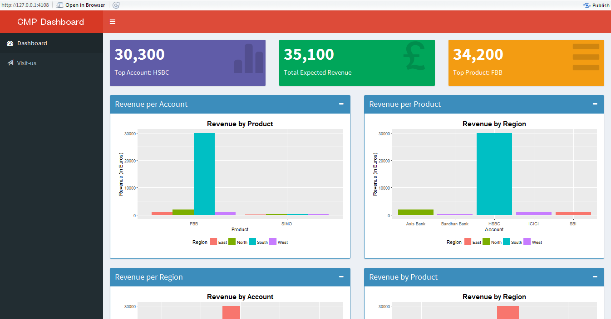

# Basic RShiny Dashboard Example
This is a basic version of Interactive Dashboard in RShiny

How to use:

* Install necessary packages used in the code
* Edit the path of the input file - *recommendation.csv* in the code
* [Run the App](https://shiny.rstudio.com/reference/shiny/latest/runApp.html) (either on default localhost ip or pass your machine's ip as an argument)

Screenshot:

